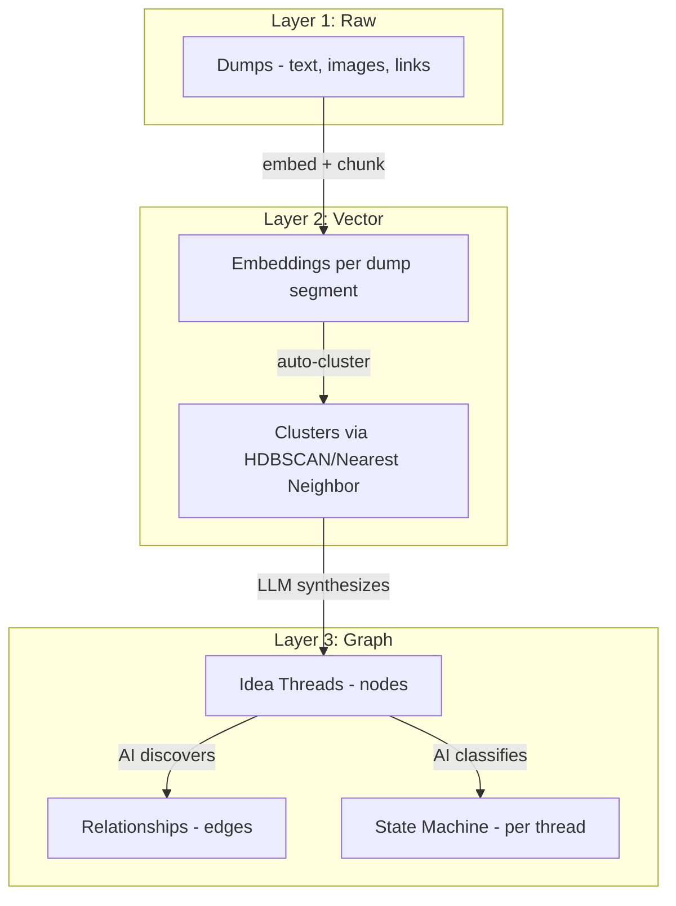

# Rynk Ideas — Technical Architecture

## The Data Problem
Traditional CRUD apps store records. Rynk Ideas deals with:
1.  **Thread Extraction**: Separating distinct ideas from a stream-of-consciousness dump.
2.  **Knowledge Graph**: Discovering non-linear connections between ideas.
3.  **Temporal State**: Tracking how an idea evolves over weeks of random dumps.

## Architecture Layers

### Layer 1: Dumps (Raw Capture)
Stored in **Cloudflare D1**.
- Raw text, media URLs (R2), metadata.
- Each "dump session" is one record.

### Layer 2: Embeddings + Clustering
1.  **Segmentation**: LLM splits dump into semantic segments.
2.  **Embedding**: **Cloudflare Workers AI** (`bge-base-en-v1.5`) generates vectors.
3.  **Clustering**: **Cloudflare Vectorize** is used to find nearest neighbors and assign segments to "Threads".

### Layer 3: Knowledge Graph
Stored in **Cloudflare D1** (Adjacency Tables).
- **Nodes**: Idea Threads (Title, Summary, State, Reality Score).
- **Edges**: Relationships (`relates_to`, `blocks`, `evolved_from`).
- **State Machine**: AI detects state (`Seed` -> `Active` -> `Stuck` -> `Done`) based on dump frequency and sentiment.

## Infrastructure
- **Runtime**: Cloudflare Workers (Edge).
- **Database**: Cloudflare D1.
- **Vector DB**: Cloudflare Vectorize.
- **Storage**: Cloudflare R2 (media).
- **AI**: Cloudflare Workers AI + Groq (for fast inference).
- **Auth**: Shared Auth.js session with `rynk-web`.
