# Rynk Ideas — Product Ideation

> *"AI without the noise"* extended to **ideas**. Dump anything. AI makes sense of it. You act on it.

## The Core Concept

Rynk Ideas is a **thought capture → AI synthesis → actionable planning** pipeline. Users dump raw thoughts, images, links, videos, voice notes — anything — and the AI organizes, connects, and grounds them into something real.

```mermaid
graph LR
    A[💭 Dump] --> B[🧠 AI Synthesis]
    B --> C[📊 Dashboard]
    C --> D[🔬 Deep Dive]
    D --> E[📋 Action & Track]
    E -->|feedback loop| B
```

## Feature Pillars

### 1. 🗑️ The Dump (Capture Layer)
The lowest-friction way to capture a thought from *anywhere*.
- **Web**: Text box, drag-and-drop.
- **Types**: Raw text, stream of consciousness, images, links.
- **Key UX**: No categories, no tags, no forms. Just dump.

### 2. 🧠 AI Synthesis (The Brain)
- **Auto-clustering**: Groups related dumps into "Idea Threads".
- **Reality checks**: Flags gaps or unrealistic assumptions.
- **Enrichment**: Auto-attaches relevant context.

### 3. 📊 The Dashboard (Bird's Eye View)
A living canvas that reflects the user's creative landscape.
- **Idea Map**: Visual graph/cluster view.
- **Board View**: Kanban-style (To Explore, Thinking About, Deciding, etc.).
- **Timeline**: Pattern recognition on your creativity.

### 4. 🔬 Deep Dive (Research & Planning)
User picks an idea → AI goes deep.
- **AI Research Report**: Thorough research on the topic.
- **Starter Kit**: Tech stack, business model canvas, etc.
- **Action Plan**: Concrete phases with timelines.

---

## UI Philosophy

> The interface should feel like a **private creative workspace**, not an enterprise tool.

1. **Dark, minimal, Rynk DNA**.
2. **Spatial over linear**.
3. **AI is ambient, not intrusive**.
4. **Capture is instant**.
